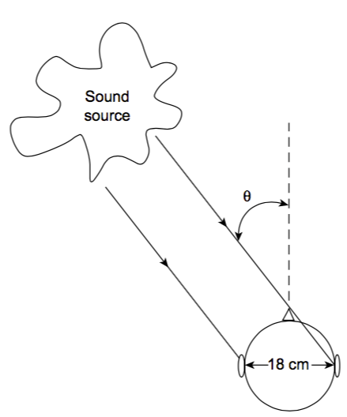
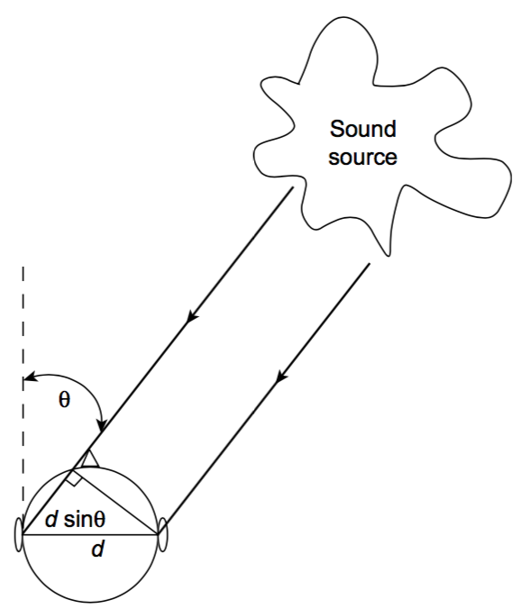

## Sound Source Localisation.. MU610A
## Edward Costello

#### Perception of Sound Source Direction

- How do we perceive the direction a sound comes from?
- Using our ears, more specifically the fact we have 2 of them
- Separated by our head which has an acoustic effect that is a function of the direction of sound
- There are 2 main effects
    1. The same sounds will arrive at different times to each ear
    2. The same sound will have a different intensities sensed by each ear

#### Interaural Time Difference (ITD)

</img>

#### Interaural Time Difference (ITD)

- As our ears are separated by about 18cm there is a slight time difference between sound arrival
- When sound is to our left, the left ear hears this first and vice-versa
- If sound is directly in front, behind or on the median plane, it will arrive at both ears simultaneously.
- This short time difference will depend on the distances each sound needs to travel

#### Interaural Time Difference (ITD)

- If you wanted to calculate the time difference between each sound a naive approach would model the problem thus
- Ears separated by distance $d$, so we must calculate the relative time difference by working out the extra distance introduced by the angle of incidence

#### Interaural Time Difference (ITD)
</img>

#### Interaural Time Difference (ITD) 
- This assumption will give the following equation for the time difference due to sound angle:

$ \Delta t = \frac{d \sin{\theta}}{c} $

- Where $\Delta t =$ the time difference between the ears (in $s$)
- $d=$ the distance between the ears (in $m$)
- $\theta=$ the angle of arrival of the sound from the median (in radians)
- and $c=$ the speed of sound in $ms^{-1}$

##### Interaural Time Difference (ITD) 

- This equation underestimates the delay between the ears as it ignores that sound must travel around the head also
- Travelling around the head adds more delay to the sound
- This delay can be calculated, using a sphere as a model for the head

#### Interaural Time Difference (ITD) 

- The distance travelled around the head for a given angle of incidence is given by:

$\Delta d = r \theta $

- Where $\Delta d=$ the extra path round the head at a given angle of incidence (in m)
- and $r=$ half the distance between the ears (in m)

#### Interaural Time Difference (ITD) 

</img>

#### Interaural Time Difference (ITD) 
- This equation can be used in conjunction with the extra path length due to the angle of incidence to give a more accurate equation for the ITD:

$ITD=\frac{r(\theta + \sin{\theta})}{c}$

#### Interaural Time Difference (ITD) 

- Using this equation we can find that the maximum ITD, which occurs at $90^{\circ}$ or ($\pi/2$ radians), is:

$ITD\_{max}=\frac{0.09m \times (\pi / 2 + \sin{\pi/2})}{344ms^{-1}} = 0.0006725920622$

$=6.73\times 10^{-4}s$

#### Interaural Time Difference (ITD) 
</img>
- This is a very small delay but a variation from this to zero determines the direction of sounds at low frequencies.

#### Interaural Time Difference (ITD) 

- There is however no difference in the delay between front and back positions at the same angle. 
- This means that we must use different mechanisms and strategies to differentiate between front and back sounds

#### Interaural Time Difference (ITD) 
- There is also a frequency limit to the way in which sound direction can be resolved by the ear in this way
- This is due to the fact that the ear appears to use the phase shift in the wave caused by the interaural time difference to resolve the direction; that is, the ear measures the phase shift given by:
- $\Phi_{ITD}=2\pi fr(\theta + \sin{\theta}))$
- $\Phi_{ITD}=$ phase difference between ears in radians
- $f=$the frequency in Hz

#### Interaural Time Difference (ITD) 

- When this phase shift is greater than $\pi$ radians ($180^{\circ}$) there will be an unresolvable ambiguity in the direction because there are two possible angles 
- One to the left and one to the right that could cause such a phase shift.
- This sets a maximum frequency, at a particular angle, for this method of sound localisation

#### Interaural Time Difference (ITD) 

- This is given by:

$f_{max}(\theta)=\frac{1}{2\times0.09m\times(\theta+\sin{\theta})}$

- For an angle of $90^{\circ}$ or $\pi/2$ is:

$f_{max}(\theta)=\frac{1}{2\times0.09m\times(\pi/2+\sin{\pi/2})}=743\text{Hz}$
- Scaling by the speed of sound $344^{-1}ms$

#### Interaural Intensity Difference (IID) 

- The other cue that is used to detect the direction of the sound is the differing levels of intensity that result at each ear due to the shading effect of the head.

#### Interaural Intensity Difference (IID) 

</img>

#### Interaural Intensity Difference (ITD) 

- The levels at each ear are equal when the sound source is on the median plane but that the level at one ear progressively reduces, and increases at the other, as the source moves away from the median plane
- The level reduces in the ear that is furthest away from the source
- Experiments seem to indicate that the intensity ratio between the two ears varies sinusoidally in a frequency dependent fashion, from 0dB up to 20 dB, depending on the sound direction

#### Interaural Intensity Difference (IID) 

</img>

#### Interaural Intensity Difference (IID) 

- Objects are not significant for sound scattering or shading until its size is ~ 2/3rds of the sound wavelength
- There will be a minimum frequency below which the effect of intensity is less useful for localisation, which will correspond to when the head is about one third of a wavelength in size
- For a head the diameter of which is 18cm, this corresponds to a minimum frequency of:
$f_{min(\theta=\pi/2)}=\frac{1}{3}\big(\frac{c}{d}\big)=\frac{1}{3}\times \big(\frac{344ms^{-1}}{0.18m}\big)=637\text{Hz}$

#### Interaural Intensity Difference (IID) 

- Thus the interaural intensity difference is a cue for direction at high frequencies whereas the interaural time difference is a cue for direction at low frequencies

#### Pinnae and Head Movement effects

- The ITD and IID do not explain how we can resolve front to back ambiguities or the elevation of the source
- This is achieved in 2 different ways:

#### Pinnae and Head Movement effects

- The first is to use the effect of our ears on the sounds we receive to resolve the angle and direction of the sound
- This is due to the fact that sounds striking the pinnae are reflected into the ear canal by the complex set of ridges that exist on the ear
- These pinnae reflections will be delayed, by a very small but significant amount, and so will form comb filter interference effects on the sound the ear receives

#### Pinnae and Head Movement effects

- The delay that a sound wave experiences will be a function of its direction of arrival, in all three dimensions, and we can use these cues to help resolve the ambiguities in direction that are not resolved by the main directional hearing mechanism
- The delays are very small and so these effects occur at high audio frequencies, typically above 5 kHz

#### Pinnae and Head Movement effects

- The second, and powerful, means of resolving directional ambiguities is to move our head
- When we hear a sound that we wish to attend to, or whose direction we wish to resolve, we turn our head towards the sound and may even attempt to place it in front of us in the normal direction, where all the delays and intensities will be the same

#### Pinnae and Head Movement effects

- The act of moving our head will change the direction of the sound arrival and this change of direction will depend on the sound source position relative to us
- Thus a sound from the rear will move in a different direction compared with a sound in front of or above the listener
- This movement cue is one of the reasons that we perceive the sound from headphones as being "in the head." Because the sound source tracks our head movement it cannot be outside and hence must be in the head

#### ITD and IID trading

- As both intensity and delay cues are used for the perception of sound source direction one might expect the mechanisms to be in similar areas of the brain and linked together
- One might also reasonably expect that there was some overlap in the way the cues were interpreted such that intensity might be confused with delay and vice versa in the brain

#### ITD and IID trading

- This allows for the possibility that the effect of one cue, for example delay, could be cancelled out by the other, for example intensity
- This effect actually occurs and is known as 'interaural time difference versus interaural intensity difference trading'

#### ITD and IID trading

- The time delay versus intensity trading is only effective over the range of delay times which correspond to the maximum interaural time delay of $673\mu s$
- Beyond this amount of delay, small intensity differences will not alter the perceived direction of the sound, it will instead appear to come from the source which arrives first
- This effect occurs between $673\mu s$ and 30ms

#### ITD and IID trading

- However, if the delayed sound's amplitude is more than 12 dB greater than the first arrival then we will perceive the direction of the sound to be towards the delayed sound
- After 30ms the delayed signal is perceived as an echo and so the listener will be able to differentiate between the delayed and undelayed sound

#### ITD and IID trading

- This means that:
    1. It should be possible to provide directional information purely through either only delay cues or only intensity cues
    2. When a sound is delayed by greater than about $700\mu s$ the ear attends to the sound that arrives first almost irrespective of the relative levels of the incoming sounds, although clearly if the earlier arriving sound is significantly lower in amplitude, compared with the delayed sound, then the effect will disappear.
 

 #### The Haas Effect

 - Another ITD and IID trading effect is known as the "Haas" or "precedence" effect, it is thus:
    - The ear will attend to the direction of the sound that arrives first and will not attend to the reflections provided they arrive within 30ms of the first sound.
    - The reflections arriving before 30ms are fused into the perception of the first arrival. However, if they arrive after 30ms they will be perceived as echoes.

 #### The Haas Effect
- These results have important implications for studios, concert halls and sound reinforcement systems
- It is important to ensure that the first reflections arrive at the audience earlier than 30ms to avoid them being perceived as echoes

#### Stereophonic listening

- Because of the way we perceive directional sound it is possible to fool the ear into perceiving a directional sound through just two loudspeakers or a pair of headphones in stereo listening
- This can be achieved in three ways: two using loudspeakers and one using headphones

#### Stereophonic listening

- The first two ways are based on the concept of providing only one of the two major directional cues in the hearing system; that is, using either intensity or delay cues and relying on the effect of the ear's time–intensity trading mechanisms to fill in the gaps

#### Delay Stereo

- This system consists of two omni-directional microphones spaced a reasonable distance apart and away from the performers. Because of the distance of the microphones a change in performer position does not alter the sound intensity much, but does alter the delay.

#### Delay Stereo

</img>
- The two channels when loudspeakers contain predominantly directional cues based on delay to the listener.

#### Intensity Stereo

- This system consists of two directional microphones placed together and pointing at the left and right extent of the performers' positions
- Because the microphones are closely spaced, a change in performer position does not alter the delay between the two sounds
- As the microphones are directional the intensity received by the two microphones does however vary

#### Intensity Stereo

</img>

#### Intensity Stereo

- The two channels when presented over loudspeakers contain predominantly directional cues based on intensity to the listener
- Intensity stereo is the method that is mostly used in pop music production, as the pan-pots on a mixing desk, which determine the position of a track in the stereo image

#### Delay and Intensity Stereo

- These two methods differ primarily in the method used to record the original performance and are independent of the listening arrangement
- Which method is used is determined by the producer or engineer on the recording

#### Binaural Stereo

- The third major way of providing a directional illusion is to use binaural stereo techniques
- This system consists of two omni-directional microphones placed on a head, real or more usually artificial, and presenting the result over headphones
- The distance of the microphones is identical to the ear spacing, and they are placed on an object which shades the sound in the same way as a human head

#### Binaural Stereo

</img>

#### Binaural Stereo

- Any change in performer position provides both intensity and delay cues to the listener: the results can be very effective 
- They must be presented over headphones because any cross-ear coupling of the two channels, as would happen with loudspeaker reproduction, would cause spurious cues and so destroy the illusion

#### Binaural Stereo
- This effect happens in reverse when listening to loudspeaker stereo over headphones, because the cross coupling that normally exists in a loudspeaker presentation no longer exist
- This is another reason why the sound is always 'in the head' when listening via conventional headphones.