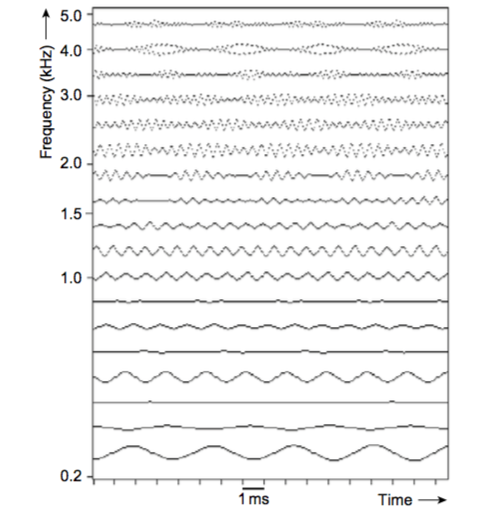

### MU610A: Acoustics & Psychoacoustics
### Edward Costello
### Notes, Harmony and Pitch Perception II

#### Temporal theory of pitch perception

- The temporal theory of pitch perception is based on the fact that the waveform of a sound with a strong musical pitch repeats or is periodic
- In the previous lecture we saw that $f_0$ of any waveform can be found from its period, or wavelength of every repetition as:

$f_0 \text{in Hz}=\frac{1}{\text{period in seconds}}$

- and the period from a known $f_0$ as:

$ \text{period in seconds}=\frac{1}{f_0 \text{in Hz}}$

#### Temporal theory of pitch perception

- The temporal theory of pitch perception relies on the timing of neural firings generated in the organ of Corti which occur in response to vibrations of the basilar membrane.
- We've seen that place theory is based on the fact that the basilar membrane is stimulated at different places along its length according to the frequency components in the input sound

#### Temporal theory of pitch perception

- The key to the temporal theory is the detailed nature of the actual waveform exciting the different places along the length of the basilar membrane
- This can be modelled using a bank of electronic band-pass filters whose center frequencies and bandwidths vary according to the critical bandwidth of the human hearing system

#### Temporal theory of pitch perception

</img>
- The above diagram shows the output waveforms from such a bank of electronic filters with critical bandwidths based on the ERB equation, for C4 played on a violin

#### Temporal theory of pitch perception

</img>
- The output waveform from the filter with a center frequency just above 200Hz, the lowest center frequency represented in the figure, is a sine wave at $f_0$

#### Temporal theory of pitch perception

</img>
- This is because the $f_0$ component is resolved by the analysing filter, and an individual harmonic of a complex periodic waveform is a sine wave

#### Temporal theory of pitch perception

- As we have seen in the previous lecture place theory suggests that the first six harmonics will be resolved by the basilar membrane
</img>

#### Temporal theory of pitch perception

</img>
- It can be seen in the example shown that the second (around 520Hz), third (around 780Hz), fourth (around 1040Hz) and fifth (around 1300Hz) harmonics are resolved and their waveforms are sinusoidal

#### Temporal theory of pitch perception

</img>
- Some amplitude variation is apparent on these sine waves, particularly on the fourth and fifth, indicating the dynamic nature of the acoustic pressure output from musical instrument.

#### Temporal theory of pitch perception

</img>

- The sixth harmonic (around 1560Hz) has greater amplitude variation, but the individual cycles are clear.

#### Temporal theory of pitch perception
</img>
- Output waveforms for filter center frequencies above the sixth harmonic in this example are not sinusoidal because these harmonics are not resolved individually

#### Temporal theory of pitch perception
</img>
- At least two harmonics are combined in the outputs from filters which are not sinusoidal

#### Temporal theory of pitch perception

- When two components close in frequency are combined, they produce a 'beat' waveform whose amplitude rises and falls regularly if the components are harmonics of some fundamental
- The period of the beat is equal to the difference between the frequencies of the two components

#### Temporal theory of pitch perception

- Therefore if the components are adjacent harmonics, then the beat frequency is equal to their $f\_0$ and the period of the beat waveform is $(1/f_0)$. 
- This can be observed in the figure by comparing the beat period for filter outputs above 1.5kHz with the period of the output sinewave at $f_0$.

#### Temporal theory of pitch perception
- Thus the period of output waveforms for filters with center frequencies higher than the sixth harmonic will be at $(1/f_0)$ for an input consisting of adjacent harmonics.

#### Temporal theory of pitch perception
- The periods of all the output waveforms which stimulate the neural firing in the organ of Corti form the basis of the temporal theory of pitch perception
- There are nerve fibers available to fire at all places along the basilar membrane, and they do so in such a manner that a given nerve fiber may only fire at one phase or instant in each cycle of the stimulating waveform, a process known as 'phase locking'

#### Temporal theory of pitch perception
- Although the nerve firing is phase locked to one instant in each cycle of the stimulating waveform, it has been observed that no single nerve fiber is able to fire continuously at frequencies above approximately 300Hz
- The nerve does not necessarily fire in every cycle and that the cycle in which it fires tends to be random

#### Temporal theory of pitch perception

- However, due to phase locking, the time between firings for any particular nerve will always be an integer $(1, 2, 3, 4, ...)$ multiple of periods of the stimulating waveform and there are a number of nerves involved at each place

#### Temporal theory of pitch perception
</img>
- The minimum time between firings (1 period of the stimulating waveform) at different places along the basilar membrane can be inferred from the diagram above for the violin playing C4, since it will be equivalent to the period of the output waveform from the analysis filter.

#### Temporal theory of pitch perception

- For places which respond to frequencies below about the sixth harmonic, the minimum time between firings is at the period of the harmonic itself, and, for places above, the minimum time between firings is the period of the input waveform itself (i.e., $1/f_0$).

#### Temporal theory of pitch perception

</img>
- The possible instants of nerve firing are illustrated in the above diagram

#### Temporal theory of pitch perception

</img>
- This shows that nerves fire phase locked to the stimulating waveform but not necessarily during every cycle.

#### Temporal theory of pitch perception
</img>
- This shows an idealized unrolled basilar membrane with places corresponding to where maximum stimulation occur for input components at multiples of $f\_{0}$ up to the sixteenth harmonic

#### Temporal theory of pitch perception

- The assumption is that harmonics up to and including the seventh are analysed separately
- The main part of the figure shows the possible instants where nerves could fire based on phase locking and the fact that nerves may not fire every cycle; the lengths of the vertical lines illustrate the proportion of firings which might occur at that position, on the basis that more firings are likely with reduced times between them

#### Temporal theory of pitch perception
- These approximate to the idea of a histogram of firings being built up, sometimes referred to as an 'interspike interval' histogram, where a 'spike' is a single nerve firing.

#### Temporal theory of pitch perception
</img>

- Thus at the place on the basilar membrane stimulated by the $f_0$ component possible times between nerve firing are: $(1/f_0)$, $(2/f_0)$ and $(3/f_0)$ with fewer firings at the higher intervals. 

#### Temporal theory of pitch perception
</img>

- For the place stimulated by the second harmonic, possible firing times are: $[1/(2 f_0)], [2/(2 f_0)]$ or $(1/f_0), [3/(2 f_0)], [4/(2 f_0)]$ or $(2/f_0)$, and so on

#### Temporal theory of pitch perception

- This is the case for each place stimulated by a harmonic of $f_0$ up to the seventh. 
- For places corresponding to higher frequencies than $(7 f_0)$, the stimulating waveform is beat-like and its fundamental period is $(1/f_0)$, and therefore the possible firing times are: $(1/f_0)$, $(2/f_0)$ and $(3/f_0)$

#### Temporal theory of pitch perception

</img>

- If the entries in all these inter-spike interval histograms were added together vertically (i.e., for each firing time interval), then the maximum entry would occur for the period of $f_0$

#### Temporal theory of pitch perception

- This is reinforced when it is remembered that all places higher than those shown in the figure would exhibit outputs similar to those shown above the eighth harmonic
- All the places where harmonics are resolved have an entry in their histograms at the fundamental period as a direct result of the fact that nerves may not fire in every cycle
- This is the basis on which the temporal theory of pitch perception is thought to function.

#### Problems with the temporal theory

- The temporal theory gives a basis for understanding how the fundamental period could be found from an analysis of the nerve firing times from all places across the basilar membrane.
- However, not all observed pitch perception abilities can be explained by the temporal theory alone, the most important being the pitch perceived for sounds whose $f_0$ is greater than 5 kHz. 

#### Problems with the temporal theory

- This cannot be explained by the temporal theory because phase locking breaks down above 5kHz. 
- Any ability to perceive the pitches of sounds with $f_0$ greater than 5kHz is therefore thought to be due to the place theory alone.

#### Problems with the temporal theory

- Given that the upper frequency limit of human hearing is at best 20 kHz for youngsters, with a more practical upper limit being 16kHz for those over 20 years of age, a sound with an $f_0$ greater than 5kHz is only going to provide the hearing system with two harmonics ($f_0$ and $2 f_0$) for analysis.

#### Problems with the temporal theory

- In practice it has been established that human pitch perception for sounds whose $f_0$ is greater than 5kHz is rather poor, with many musicians finding it difficult to judge accurately musical intervals in this frequency range. 
- This ties in well with $f_0$ for the upper note of the piccolo being approximately 4.5kHz. 

#### Contemporary theory of pitch perception

- Psychoacoustic research has tended historically to consider human pitch perception with reference to the place or the temporal theory, and it is clear that neither theory alone can account for all observed pitch perception abilities
- In reality, place analysis occurs giving rise to nerve firings from each place on the basilar membrane that is stimulated

#### Contemporary theory of pitch perception

- Thus nerve centers and the parts of the brain concerned with auditory processing are provided not only with an indication of the place where basilar membrane stimulation occurs (frequency analysis) but also with information about the nature of that stimulation (temporal analysis).
- Therefore neither theory is likely to explain human pitch perception completely, since the output from either the place or temporal analysis makes use of the other in communicating itself on the auditory nerve.

#### Contemporary theory of pitch perception

</img>
- Above shows a model for pitch perception of complex tones which encapsulates the benefits described for both theories

#### Contemporary theory of pitch perception

- The acoustic pressure wave is modified by the frequency response of the outer and middle ears, and analysed by the place mechanism which is equivalent to a filter bank analysis.
- Neural firings occur stimulated by the detailed vibration of the membrane at places equivalent to frequency components of the input sound based on phase locking but not always once per cycle, the latter is illustrated on the right-hand side of the figure.

#### Contemporary theory of pitch perception

- The fact that firing is occurring from particular places provides the basis for the place theory of pitch perception. 
- The intervals between neural firings (spikes) are analysed and the results are combined to allow common intervals to be found which will tend to be at the fundamental period and its multiples, but predominantly at $(1/f_0)$.

#### Contemporary theory of pitch perception

- This is the basis of the temporal theory of pitch perception. 
- The pitch of the sound is based on the results.

#### Secondary aspects of pitch perception

- The perceived pitch of a sound is primarily affected by changes in $f_0$, which is why the pitch of a note is usually directly related to its $f_0$, for example by stating that A4 has an $f_0$ of 440Hz as a standard pitch reference
- The estimation of $f_0$ forms the basis of both the place and temporal theories of pitch perception

#### Secondary aspects of pitch perception

- A change in pitch of a particular musical interval manifests itself if the $f_0$ values of the notes concerned are in the appropriate frequency ratio to give the primary acoustic (objective) basis for the perceived (subjective) pitch of the notes and hence the musical interval.

#### Secondary aspects of pitch perception

- Changes in pitch are also perceived by modifying the intensity or duration of a sound while keeping $f_0$ constant. 
- These are by far only secondary pitch change effects compared with the result of varying $f\_0$, and they are often very subtle.

#### Secondary aspects of pitch perception

- If the intensity of a sine wave is varied between 40dB SPL and 90dB SPL while keeping its $f_0$ constant, a change in pitch is perceived for all $f\_0$ values other than those around 1-2 kHz
- For $f\_0$ values greater than 2 kHz the pitch becomes sharper as the intensity is raised, and for $f_0$ values below 1kHz the pitch becomes flatter as the intensity is raised

#### Secondary aspects of pitch perception

</img>

- The JND for pitch is shown with reference to the pitch at 60dB SPL to enable the frequencies and intensities of sine waves for which the effect might be perceived to be inferred

#### Secondary aspects of pitch perception

- This effect is for sine waves which are rarely encountered in music, although electronic synthesizers have made them widely available.
- With complex tones the effect is less well defined; around 17 cents (0.17 of a semitone) for an intensity change between 65dB SPL and 95dB SPL.

#### Secondary aspects of pitch perception
</img>
- The effect that the duration of a sound has on the perception of the pitch of a note is summarized graphically in the above diagram

#### Secondary aspects of pitch perception
</img>

- This shows the minimum number of cycles required at a given $f_0$ for a definite distinct pitch to be perceived

#### Secondary aspects of pitch perception
</img>
- Shorter sounds may be perceived as being pitched rather than non-pitched, the accuracy listeners can make such a judgement at worsens as the duration of the sound drops below that shown in the figure

#### Hearing Harmony

- The music of different cultures can vary considerably in many aspects including, for example, pitch, rhythm, instrumentation, available dynamic range, and the basic melodic and harmonic usage in the music
- Hearing harmony is basic to music appreciation, and in its basic form harmony is sustained by means of chords

#### Hearing Harmony

- A chord consists of at least two notes sounding together and it can be described in terms of the musical intervals between the individual notes which make it up
- A basis for understanding the psychoacoustics of a chord is given by considering the perception of any two notes sounding together.

#### Hearing Harmony

</img>

- The full set of commonly considered two-note intervals and their names are shown relative to middle C

#### Hearing Harmony

- Each of the augmented and diminished intervals sounds the same as another interval shown if played on a modern keyboard 
- For example: the augmented unison and minor second, the augmented fourth and diminished fifth, the augmented fifth and minor sixth, and the major seventh and diminished octave, but they are notated differently on the stave and, depending on the tuning system in use, these "enharmonics" would sound different also.

#### Hearing Harmony

- The development of harmony in Western music can be viewed in terms of the decreasing musical interval size between adjacent members of the natural harmonic series as the harmonic number is increased
- The musical interval between adjacent harmonics must reduce as the harmonic number is increased since it is determined in terms of the $f_0$ of the notes concerned by the ratio of the harmonic numbers themselves (e.g. 2:1, 3:2, 4:3, 5:4, 6:5, etc.).

#### Hearing Harmony

- The earliest polyphonic Western music, known as "organum," made use of the octave, the perfect fifth, and its inversion, the perfect fourth
- These are the intervals between the 1st and 2nd, the 2nd and 3rd, and the 3rd and 4th members of the natural harmonic series respectively

#### Hearing Harmony

- Later, the major and minor third began to be accepted, the intervals between the 4th and 5th, and the 5th and 6th natural harmonics, with their inversions, the minor and major sixth respectively which are the intervals between the 5th and 8th, and the 3rd and 5th harmonics respectively.

#### Hearing Harmony

- The major triad, and the minor triad became the building block of Western tonal harmony. 
- The interval of the minor seventh started to be incorporated, and its inversion the major second, the intervals between the 4th and 7th, and the 7th and 8th harmonics respectively. 

#### Hearing Harmony

- Twentieth century composers have explored music composed using 
    - major and minor whole tones (the intervals between the 8th and 9th, and between the 9th and 10th harmonics respectively), 
    - semitones (adjacent harmonics above the 11th are spaced by intervals close to semitones) 
    - and microtones or intervals of less than a semitone (adjacent harmonics above the 16th are spaced by microtones.)

#### Consonance and Dissonance

- The development of Western harmony follows a pattern where the intervals central to musical development have been gradually ascending the natural harmonic series
- These changes have occurred partly as a function of increasing acceptance of intervals which are deemed to be musically 'consonant,' or pleasing to listen to, as opposed to 'dissonant,' or unpleasant to the listener.

#### Consonance and Dissonance

- The psychoacoustic basis behind consonance and dissonance relates to critical bandwidth, which provides a means for determining the degree of consonance (or dissonance) of musical intervals.

#### Consonance and Dissonance

</img>

- The figure above shows the perceived effect of two sine waves heard together when the difference between their frequencies was increased from 0 to above one critical bandwidth.

#### Consonance and Dissonance

</img>

- Listeners perceive a change from 'rough' to 'smooth' when the frequency difference crosses the critical bandwidth. In addition, a change occurs between 'rough fused' to 'rough separate' as the frequency difference is increased within the critical bandwidth.

#### Consonance and Dissonance

</img>
- Figure above shows the result of an experiment by Plomp and Levelt (1965) to determine to what extent two sine waves played together sound consonant or dissonant as their frequency difference is altered

#### Consonance and Dissonance

</img>
- Listeners with no musical training were asked to indicate the consonance, or pleasantness, of two sine waves played together.

#### Consonance and Dissonance

</img>
- The result is the continuous pattern of response shown in the figure, with no particular musical interval being prominent in its degree of perceived consonance.

#### Consonance and Dissonance

-  Intervals greater than a minor third are judged to be consonant for all frequency ratios. The following can be concluded:
    - When the frequencies are equal (unison) the tones are judged to be 'perfectly consonant.'
    - When their frequency difference is greater than one critical bandwidth, they are judged consonant.

#### Consonance and Dissonance
- continued...
    - For frequency differences of between 5 and 50% of the critical bandwidth the interval is dissonant.
    -  Maximum dissonance occurs when the frequency difference is a quarter of a critical bandwidth.

#### Consonance and Dissonance 

- Few musical instruments ever produce a sinusoidal acoustic waveform, and the results relating consonance and dissonance to pure tones can be extended to the perception of musical intervals heard when instruments which produce complex periodic tones play together.

#### Consonance and Dissonance 
- For each note of the chord, each harmonic that would be resolved by the hearing system if the note were played alone, that is all harmonics up to about the seventh, contributes to the overall perception of consonance or dissonance depending on its frequency proximity to a harmonic of another note in the chord.
- The overall consonance (dissonance) of a chord is based on the total consonance (dissonance) contribution from each of these harmonics.

#### Hearing Musical Intervals

- Musical intervals can be ordered by decreasing consonance on this psychoacoustic basis
- To determine the degree of consonance of a musical interval consisting of two complex tones, each with all harmonics present, the frequencies up to the frequency of the seventh harmonic of the lower notes are found

#### Hearing Musical Intervals

- Then the critical bandwidth at each frequency midway between harmonics of each note that are closest in frequency is found to establish whether or not they are within 5 to 50% of a critical bandwidth
- Therefore adding a dissonance contribution to the overall perception when the two notes are played together.

#### Hearing Musical Intervals

- If the harmonic of the upper note is midway between harmonics of the lower note, the test is carried out with the higher frequency pair since the critical bandwidth will be larger
- The positions of the following table entries indicate this.

#### Hearing Musical Intervals

</img>

- The table above shows this calculation for two notes whose $f_0$ values are a perfect fifth apart ($f_0$ frequency ratio is 3:2), the lower note having an $f_0$ of 220Hz

#### Hearing Musical Intervals

</img>

- The frequency difference between each harmonic of each note and its closest neighbour harmonic in the other note is calculated (the higher of the two is used in the case of a tied distance) to give the entries in column 3

#### Hearing Musical Intervals

</img>

- The frequency midway between these harmonic pairs is found (column 4), and the critical bandwidth for these mid-frequencies is calculated (column 5)

#### Hearing Musical Intervals

- The contribution to dissonance of each of the harmonic pairs is given in the right-hand column as follows:
    - (i) If they are in unison (equal frequencies) they are 'perfectly consonant,' shown as 'C' (note that their frequency difference is less than 5% of the critical bandwidth)

#### Hearing Musical Intervals

- The contribution to dissonance of each of the harmonic pairs is given in the right-hand column as follows:
     - (ii) If their frequency difference is greater than the critical bandwidth of the frequency midway between them (i.e., the entry in column 3 is greater than that in column 5) they are 'consonant,' shown as 'c.'

#### Hearing Musical Intervals

- The contribution to dissonance of each of the harmonic pairs is given in the right-hand column as follows:
   - (iii) If their frequency difference is less than half the critical bandwidth of the frequency midway between them (i.e., the entry in column 3 is less than that in column 6) they are 'highly dissonant,' shown as 'D.'

#### Hearing Musical Intervals

- The contribution to dissonance of each of the harmonic pairs is given in the right-hand column as follows:
    - (iv) If their frequency difference is less than the critical bandwidth of the frequency midway between them but greater than half that critical bandwidth (i.e., the entry in column 3 is less than that in column 5 and greater than that in column 6) they are 'dissonant,' shown as 'd.'

#### Hearing Musical Intervals

- The contribution to dissonance depends on where the musical interval occurs between adjacent harmonics in the natural harmonic series. 
- The higher up the series it occurs, the greater the dissonant contribution made by harmonics of the two notes concerned.
- The case of a two-note unison is trivial in that all harmonics are in unison with each other and all con- tribute as 'C.'

#### Hearing Musical Intervals

- For the octave, all harmonics of the upper note are in unison with harmonics of the lower note contributions as 'C.'
- We will look at the contribution to dissonance and consonance for the intervals perfect fifth (3:2), perfect fourth (4:3), major third (5:4), minor third (6:5) and major whole tone (9:8) respectively. 

#### Hearing Musical Intervals

- The dissonance of the chord in each case is related to the entries in the final column which indicate increased dissonance in the order C, c, d and D
- It can be seen that the dissonance increases as the harmonic number increases and the musical interval decreases.

#### Hearing Musical Intervals

</img>

#### Hearing Musical Intervals

</img>

#### Hearing Musical Intervals

</img>

#### Hearing Musical Intervals

</img>

#### Hearing Musical Intervals

- The harmonics which are in unison with each other can be predicted from the harmonic number
- For example, in the case of the perfect fourth the fourth harmonic of the lower note is in unison with the third of the upper note because their f0 values are in the ratio (4:3).

#### Hearing Musical Intervals

</img>

#### Hearing Musical Intervals

- For the major whole tone (9:8), the unison will occur between harmonics (the eighth of the upper note and the ninth of the lower) which are not resolved by the auditory system for each individual note.

#### Hearing Musical Intervals

- The degree of dissonance of a given musical interval will vary depending on the $f_0$ value of the lower note, due to the nature of the critical bandwidth with center frequency 
- This can be seen in the following tables for the major third where the $f_0$ of the lower note is one octave and two octaves below that used in the previous examples at 110Hz and 55 Hz respectively
- The number of 'D' entries increases in each case as the f0 values of the two notes are lowered.

#### Hearing Musical Intervals

</img>

#### Hearing Musical Intervals

</img>

#### Hearing Musical Intervals

</img>

#### Hearing Musical Intervals

- This increase in dissonance of any given interval, excluding the unison and octave which are equally consonant at any pitch on this basis, manifests itself in terms of preferred chord spacings in classical harmony.

#### Hearing Musical Intervals

- As a rule when writing four-part harmony such as SATB (soprano, alto, tenor, bass) hymns, the bass and tenor parts are usually no closer together than a fourth except when they are above the bass staff, because the result would otherwise sound 'muddy' or 'harsh.'

#### Tuning Systems

- Musical scales are basic to most Western music. Modern keyboard instruments have 12 notes per octave with a musical interval of one semitone between adjacent notes.
- All common Western scales incorporate octaves whose frequency ratios are (2:1)
- Therefore it is only necessary to consider notes in a scale over a range of one octave, since the frequencies of notes in other octaves can be found from them.

#### Pythagorean tuning

- Early scales were based on one or more of the musical intervals found between members of the natural harmonic series
- The Pythagorean scale is built up from the perfect fifth.

#### Pythagorean tuning

- Starting, for example, from the note C and going up in 12 steps of a perfect fifth produces the circle of fifths: C, G, D, A, E, B, F#, C#, G#, D#, A#, E#, c.
- The final note after 12 steps around the circle of fifths, shown as c, has a frequency ratio to the starting note, C, of the frequency ratio of the perfect fifth (3:2) multiplied by itself 12 times, or:

$$ \frac{c}{C}=\Big(\frac{3}{2}\Big)^{12} = 129.746 $$

#### Pythagorean tuning

- An interval of 12 fifths is equivalent to seven octaves, and the frequency ratio for the note (c') which is seven octaves above C is:

$$ \frac{c'}{C}=2^7 = 128 $$

#### Pythagorean tuning

- Thus 12 perfect fifths (C to c) is slightly sharp compared with seven octaves (C to c') of the so-called 'Pythagorean comma' which has a frequency ratio:

$$ \frac{c}{c'}=\frac{129.746}{128} = 1.01364 $$

#### Pythagorean tuning

- If the circle of fifths were established by descending by perfect fifths instead of ascending, the resulting note 12 fifths below the starting notes would be flatter than seven octaves by 1.0136433, and every note of the descending circle would be slightly different from the members of the ascending circle. 

#### Pythagorean tuning

</img>

- Above shows this effect and the manner in which the notes can be notated. 

#### Pythagorean tuning

</img>

- For example, notes such as D# and Eb, A# and Bb, Bbb and A are not the same and are known as 'enharmonics,' giving rise to the pairs of intervals such as major third and diminished fourth, and major seventh and diminished octave

#### Pythagorean tuning

- The Pythagorean scale can be built up on the starting note C by making F and G an exact perfect fourth and perfect fifth respectively (maintaining a perfect relationship for the sub-dominant and dominant respectively):
$$ \frac{F}{C} = \frac{4}{3} $$

$$ \frac{G}{C} = \frac{3}{2} $$

#### Pythagorean tuning

- The frequency ratios for the other notes of the scale are found by ascending in perfect fifths from G and, when necessary, bringing the result down to be within an octave of the starting note. 

#### Pythagorean tuning

- Below shows the frequency ratios between adjacent notes of the Pythagorean major scale.

</img>

#### Just tuning

- Another important scale is the 'just diatonic' scale which is made by keeping the intervals that make up the major triads pure: the octave (2:1), the perfect fifth (3:2) and the major third (5:4) for triads on the tonic, dominant and sub-dominant. 
- The dominant and sub-dominant keynotes are a perfect fifth above and below the key note respectively. 

#### Just tuning

- This produces all the notes of the major scale (any of which can be harmonized using one of these three chords). 
- Taking the note C being used as a starting reference for convenience, the major scale is built as follows.

#### Just tuning

- The notes E and G are a major third (5:4) and a perfect fifth (3:2) respectively above the tonic, C:

$$ \frac{E}{C} = \frac{5}{4} $$

$$ \frac{G}{C} = \frac{3}{2} $$

#### Just tuning
- The frequency ratios of B and D are a major third (5:4) and a perfect fifth (3:2) respectively above the dominant, G, and they are related to C as:

$$ \frac{B}{C} = \frac{5}{4} \times \frac{G}{C} = \frac{5}{4} \times \frac{3}{2} = \frac{15}{8}$$

$$ \frac{D}{C} = \frac{3}{2} \times \frac{G}{C} \times \frac{1}{2} = \frac{3}{2} \times \frac{3}{2} \times \frac{1}{2} = \frac{9}{8}$$

- D is brought down one octave to keep it within an octave of the C.

#### Just tuning

- The frequency ratios of A and C are a major third (5:4) and a perfect fifth (3:2) respectively above the sub-dominant F. The F is therefore a perfect fourth (4:3) above the C (perfect fourth plus a perfect fifth is an octave):

$$ \frac{F}{C} = \frac{4}{3}$$

$$ \frac{A}{C} = \frac{5}{4} \times \frac{F}{C} = \frac{5}{4} \times \frac{4}{3} = \frac{5}{3}$$

#### Just tuning

- The frequency ratios of the members of the just diatonic major scale are shown below relative to C for convenience, along with the frequency ratios between adjacent notes 

</img>

#### Just tuning

- The figure shows that the just diatonic major scale has equal semitone intervals, but two different tone intervals, the larger of which is known as a 'major whole tone' and the smaller as a 'minor whole tone'

</img>

#### Just tuning
- The two whole tone and the semitone intervals appear as members of the musical intervals between adjacent members of the natural harmonic series which means that the notes of the scale are as consonant with each other as possible for both melodic and harmonic musical phrases. 
- However, the presence of two whole tone intervals means that this scale can only be used in one key since each key requires its own tuning.

#### Just tuning

- In order to tune a musical instrument for practical purposes to enable it to be played in a number of different keys, the Pythagorean comma has to be distributed among some of the fifths in the circle of fifths such that the note reached after 12 fifths is exactly seven octaves above the starting note. 

#### Just tuning

- This can be achieved by flattening some of the fifths, possibly by different amounts, while leaving some perfect, or flattening all of the fifths by varying amounts, or even by additionally sharpening some and flattening others to compensate. 

#### Just tuning
- There is therefore an infinite variety of possibilities, but none will result in just tuning in all keys. 
- Many tuning systems were experimented with to provide tuning of thirds and fifths which were close to just tuning in some keys at the expense of other keys whose tuning could end up being so out-of-tune as to be unusable musically.

#### Equal tempered tuning

- The spreading of the Pythagorean comma unequally among the fifths in the circle results in an 'unequal temperament.' 
- Another possibility is to spread it evenly to give 'equal temperament', which makes modulation to all keys possible where each one is equally out-of-tune with the just scale.

#### Equal tempered tuning

- This is the tuning system commonly found on modern keyboard instruments. 
- All semitones are equal to one twelfth of an octave. Therefore the frequency ratio (r) for an equal tempered semitone is a number which when multiplied by itself 12 times is equal to 2, or:

$$ r = \sqrt[\leftroot{-1}\uproot{2}\scriptstyle 12]{2} = 1.0595 $$

#### Equal tempered tuning
- The equal tempered semitone is subdivided into 'cents,' where one cent is one hundredth of an equal tempered semitone. The frequency ratio for one cent (c) is therefore:

$$ c = \sqrt[\leftroot{-1}\uproot{2}\scriptstyle 100]{r} =  \sqrt[\leftroot{-1}\uproot{2}\scriptstyle 100]{1.0585} = 1.000578 $$

#### Equal tempered tuning

- Music can be played in all keys when equal tempered tuning is used, as all semitones and tones have identical frequency ratios. 
- However, no interval is in-tune in relation to the intervals between adjacent members of the natural harmonic series therefore none is perfectly consonant

#### Equal tempered tuning

- However, intervals of the equal tempered scale can still be considered in terms of their consonance and dissonance, because although harmonics of pairs of notes that are in unison for pure intervals are not identical in equal temperament, the difference is within the 5% critical bandwidth criterion for consonance. 
- Beats will exist between some harmonics in equal tempered chords which are not present in their pure counterparts.